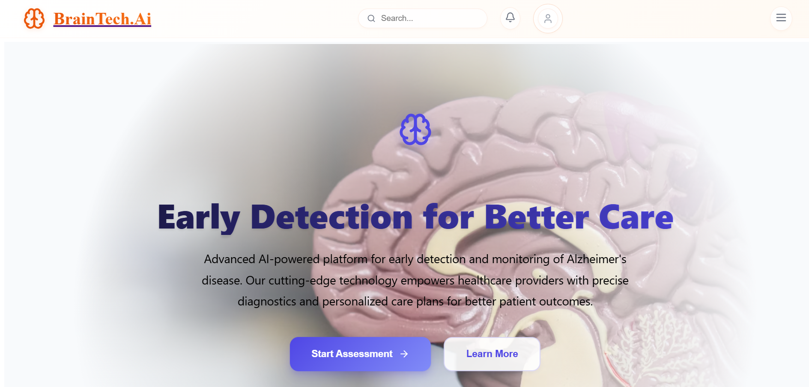
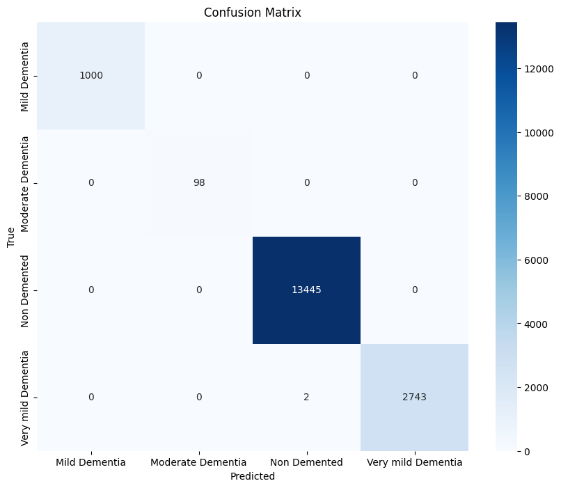

# BrainTech.AI - AI-Powered Dementia Diagnosis & Patient Support



## 🚀 About the Project
BrainTech.AI is an AI-powered healthcare platform designed to assist dementia patients and connect them with specialized doctors. It enables MRI scan analysis for early dementia detection, provides medical insights for doctors, and offers a digital prescription system, reducing paper usage and promoting environmental sustainability. Additionally, our blogging platform helps patients share their journey and spread awareness about dementia.

## 📌 Features
- 🏥 **Patient-Doctor Connection** - A seamless platform connecting dementia patients with doctors.
- 🧠 **AI-Based Dementia Detection** - Upload MRI scans and get AI-powered diagnostic results with 99% accuracy.
- 📊 **Medical Insights for Doctors** - Provides detailed insights and progression analysis of dementia cases.
- 📝 **Digital Prescription System** - Saves prescriptions online, reducing paper usage and improving accessibility.
- 📖 **Blogging Platform** - Patients can share their experiences, spreading awareness and encouraging early diagnosis.

---
## 🏗️ Tech Stack
- **Backend:** Node.js, Flusk
- **Frontend:** ReactJs
- **Database:** SQL
- **Deep Learning** Tensorflow

---
## 🎯 Model Performance

| Metric        | Value  |
|--------------|--------|
| **Accuracy**  | 99%   |
| **Precision** | 99%   |
| **Recall**    | 99%   |
| **F1 Score**  | 99%   |

📌 **Confusion Matrix:**


 

---
## 🏆 Mission & Vision
**Mission:** To provide an AI-driven healthcare solution that enables early dementia detection, simplifies medical consultations, and spreads awareness, ensuring better patient care and support.

**Vision:** To be a leading AI-powered dementia diagnosis and awareness platform, improving lives through technology and healthcare collaboration.

---
## 🔍 SWOT Analysis
### **Strengths:**
- Highly accurate dementia detection model.
- Seamless patient-doctor connectivity.
- Environmentally friendly prescription system.

### **Weaknesses:**
- Dependence on AI model improvements.
- Limited to MRI-based dementia diagnosis.

### **Opportunities:**
- Expanding AI detection to other neurological disorders.
- Integration with hospital management systems.

### **Threats:**
- Privacy concerns regarding medical data.
- Challenges in regulatory approvals for AI-based diagnostics.

---
## ⚡ Installation & Usage
1. Clone the repository:
   ```sh
   git clone https://github.com/rudrasish2003/BrainTech.AI-Diversion2k25.git
   cd BrainTech.AI
   ```
2. Install dependencies:
   ```sh
   pip install -r requirements.txt
   ```
3. Run the application:
   ```sh
   python app.py
   ```
4. Access at: `http://localhost:5000`

---
## 📌 Future Scope
- ✅ Enhancing AI model accuracy for better diagnostics.
- ✅ Integration with wearable health monitoring devices.
- ✅ Expansion into other neurodegenerative diseases.

---
## 👨‍💻 Contributors
- **Arittra Bag** - Model Training , Integration & Backend
- **Soumyajit Datta** - Backend & PPT
- **Rudrasish Dutta** - Model Training & Data Collection
- **Swarup Mitra** - FrontEnd

---
## 📜 License
This project is licensed under the MIT License - see the [LICENSE](LICENSE) file for details.

---
## ⭐ Support & Feedback
If you like this project, don't forget to ⭐ star the repository! Feel free to contribute or raise an issue for improvements. 🚀

